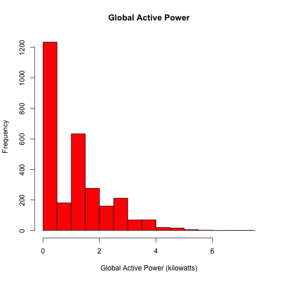

# Exploratory Data Analysis - Assignment 1
As mentioned in the discussion forum (see [[https://www.coursera.org/learn/exploratory-data-analysis/discussions/weeks/1/threads/Qi7g_6A4Eea8DBIggA9NJg]]) it is not entirely clear whether usage of ggplot2 is premitted.
I therefore also used base plotting in addition to my original sumbission that used only ggplot2.

## Plots using R base plotting
### Plot 1
 

### Plot 2
 

### Plot 3

 

### Plot 4

 

## Plots using ggplot2
### Plot 1
 

### Plot 2
 

### Plot 3

 

### Plot 4

 
